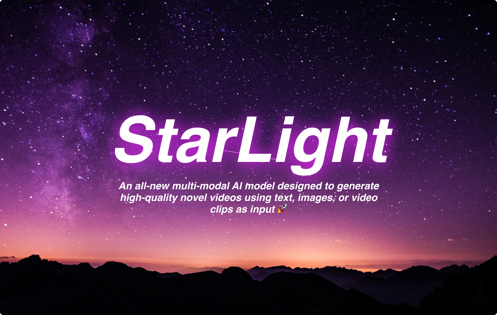

[](https://discord.gg/qUtxnK2NMf)


# 🌌 Starlight Vision 🚀


🪐 Starlight Vision is a powerful multi-modal AI model designed to generate high-quality novel videos using text, images, or video clips as input. By leveraging state-of-the-art deep learning techniques, it can synthesize realistic and visually impressive video content that can be used in a variety of applications, such as movie production, advertising, virtual reality, and more. 🎥

## 🌟 Features

- 📝 Generate videos from text descriptions
- 🌃 Convert images into video sequences
- 📼 Extend existing video clips with novel content
- 🔮 High-quality output with customizable resolution
- 🧠 Easy to use API for quick integration

## 📦 Installation

To install Starlight Vision, simply use pip:

```bash
pip install starlight-vision
```

## 🎬 Quick Start

After we train you can install Starlight Vision and can start generating videos using the following code:

```python
import torch
from starlight_vision import Unet3D, ElucidatedStarlight, StarlightTrainer

unet1 = Unet3D(dim = 64, dim_mults = (1, 2, 4, 8)).cuda()

unet2 = Unet3D(dim = 64, dim_mults = (1, 2, 4, 8)).cuda()

# elucidated starlight, which contains the unets above (base unet and super resoluting ones)

starlight = ElucidatedStarlight(
    unets = (unet1, unet2),
    image_sizes = (16, 32),
    random_crop_sizes = (None, 16),
    temporal_downsample_factor = (2, 1),        # in this example, the first unet would receive the video temporally downsampled by 2x
    num_sample_steps = 10,
    cond_drop_prob = 0.1,
    sigma_min = 0.002,                          # min noise level
    sigma_max = (80, 160),                      # max noise level, double the max noise level for upsampler
    sigma_data = 0.5,                           # standard deviation of data distribution
    rho = 7,                                    # controls the sampling schedule
    P_mean = -1.2,                              # mean of log-normal distribution from which noise is drawn for training
    P_std = 1.2,                                # standard deviation of log-normal distribution from which noise is drawn for training
    S_churn = 80,                               # parameters for stochastic sampling - depends on dataset, Table 5 in apper
    S_tmin = 0.05,
    S_tmax = 50,
    S_noise = 1.003,
).cuda()

texts = [
    'a whale breaching from afar',
    'young girl blowing out candles on her birthday cake',
    'fireworks with blue and green sparkles',
    'dust motes swirling in the morning sunshine on the windowsill'
]

videos = torch.randn(4, 3, 10, 32, 32).cuda() # (batch, channels, time / video frames, height, width)

# feed images into starlight, training each unet in the cascade
# for this example, only training unet 1

trainer = StarlightTrainer(starlight)

# you can also ignore time when training on video initially, shown to improve results in video-ddpm paper. eventually will make the 3d unet trainable with either images or video. research shows it is essential (with current data regimes) to train first on text-to-image. probably won't be true in another decade. all big data becomes small data

trainer(videos, texts = texts, unet_number = 1, ignore_time = False)
trainer.update(unet_number = 1)

videos = trainer.sample(texts = texts, video_frames = 20) # extrapolating to 20 frames from training on 10 frames

videos.shape # (4, 3, 20, 32, 32)

```

## 🤝 Contributing

We welcome contributions from the community! If you'd like to contribute, please follow these steps:

1. 🍴 Fork the repository on GitHub
2. 🌱 Create a new branch for your feature or bugfix
3. 📝 Commit your changes and push the branch to your fork
4. 🚀 Create a pull request and describe your changes

## 📄 License

Starlight Vision is released under the APACHE License. See the [LICENSE](LICENSE) file for more details.

## 🗺️ Roadmap

The following roadmap outlines our plans for future development and enhancements to Starlight Vision. We aim to achieve these milestones through a combination of research, development, and collaboration with the community.

### 🚀 Short-term Goals

- [ ] Improve text-to-video synthesis by incorporating advanced natural language understanding techniques
- [ ] Train on LAION-5B and video datasets
- [ ] Enhance the quality of generated videos through the implementation of state-of-the-art generative models
- [ ] Optimize the model for real-time video generation on various devices, including mobile phones and edge devices
- [ ] Develop a user-friendly web application that allows users to generate videos using Starlight Vision without any programming knowledge
- [ ] Create comprehensive documentation and tutorials to help users get started with Starlight Vision

### 🌌 Medium-term Goals

- [ ] Integrate advanced style transfer techniques to allow users to customize the visual style of generated videos
- [ ] Develop a plugin for popular video editing software (e.g., Adobe Premiere, Final Cut Pro) that enables users to utilize Starlight Vision within their existing workflows
- [ ] Enhance the model's ability to generate videos with multiple scenes and complex narratives
- [ ] Improve the model's understanding of object interactions and physics to generate more realistic videos
- [ ] Expand the supported input formats to include audio, 3D models, and other media types

### 🌠 Long-term Goals

- [ ] Enable users to control the generated video with more granular parameters, such as lighting, camera angles, and object placement
- [ ] Incorporate AI-driven video editing capabilities that automatically adjust the pacing, color grading, and transitions based on user preferences
- [ ] Develop an API for real-time video generation that can be integrated into virtual reality, augmented reality, and gaming applications
- [ ] Investigate methods for training Starlight Vision on custom datasets to generate domain-specific videos
- [ ] Foster a community of researchers, developers, and artists to collaborate on the continued development and exploration of Starlight Vision's capabilities

# Join Agora
Agora is advancing Humanity with State of The Art AI Models like Starlight, join us and write your mark on the history books for eternity!

https://discord.gg/sbYvXgqc


## 🙌 Acknowledgments

This project is inspired by state-of-the-art research in video synthesis, such as the Structure and Content-Guided Video Synthesis with Diffusion Models paper, and leverages the power of deep learning frameworks like PyTorch.

We would like to thank the researchers, developers, and contributors who have made this project possible. 💫